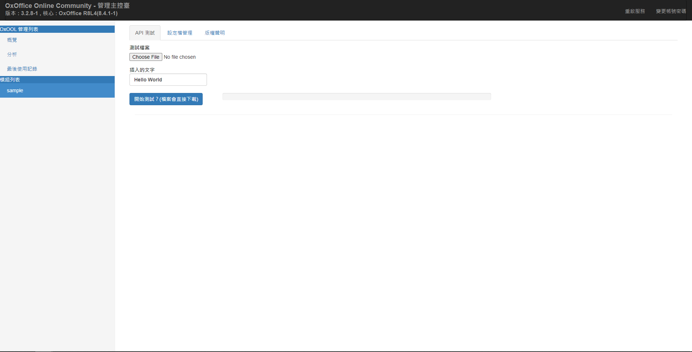

# 如何製作一個自己的 OxOOL 模組?

詳細的開發文件請至至 [OxOffice Online 技術手冊
](https://docs.ossii.com.tw/books/oxoffice-online-%E6%8A%80%E8%A1%93%E6%89%8B%E5%86%8A)來取得資訊，這邊只簡單說明如何快速的編譯測試與創造新的專案。

## 編譯/打包本專案

請先閱讀上面的技術手冊了解取得 oxool-devel 的方法 

本地端編譯與測試開發
```
./autogen.sh

./configure --enable-debug

make -j4

cp src/.libs/libtest.so.0.0.0 PATH_TO_oxool-community/libtest.so
```


打包
```
./autogen.sh

./configure

make dist

rpmbuild -ta oxool-module-sample-1.0.0.tar.gz
```

## 測試本專案

需搭配 oxool-community 才能掛載此模組並進行 API 測試

執行 oxool-community 以後打開 http://your_ip:9980/loleaflet/dist/admin/sample，並輸入帳密 admin/admin 可以看到這個頁面。



接下來請依照下列順序
1. 選擇一個 ODT 檔案
2. 修改「插入文字」欄位
3. 點選開始測試

## 快速建構一個自己的模組專案

請執行下面指令並輸入新的模組名稱 
```
./create_your_module.sh
```

執行完後，新的專案會建立於上層目錄。